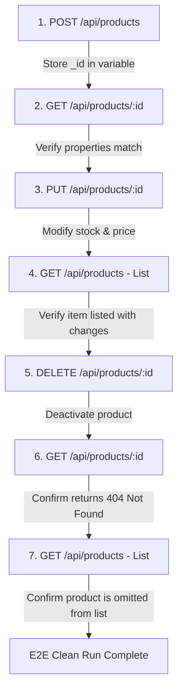

# Product Management Module: API Testing Strategy

**Author**: Senior Backend Engineer  
**Status**: Proposal for Review  
**Target Branch**: `urvi`  
**Associated Issue**: GitHub Issue #3: "Design Product API Testing Strategy"

---

## 1. Scope & Objective

This document outlines the API testing strategy for the **Product Management Module** REST APIs. The goal is to ensure the functional correctness, validation reliability, query accuracy, and error-handling robustness of all product endpoints before they are deployed to staging. Testing will primarily be executed using a **Postman Collection** with automated test scripts.

---

## 2. Traceability Matrix

| API Endpoint | CRUD Operation | Key Test Categories |
| :--- | :--- | :--- |
| `POST /api/products` | Create | Success Path, Schema Validation, SKU Duplicate Prevention, Body Malformation |
| `GET /api/products` | Read (List) | Pagination Boundaries, Search Filters, Category/Price Range filters, Query Combination, Sorts |
| `GET /api/products/:id`| Read (Single) | ID Success Path, Invalid ObjectId, Nonexistent ID, Soft-Delete Exclusion |
| `PUT /api/products/:id`| Update | Partial Update, Duplicate SKU Conflicts, Schema Validation, Nonexistent ID |
| `DELETE /api/products/:id`| Delete | Soft-Delete Execution, Re-deletion Safety, Nonexistent ID |

---

## 3. Test Cases Specification

### 3.1. Create Product (`POST /api/products`)
* **TC-PROD-C1: Success Path**
  * Send valid product payload.
  * Verify `201 Created` status code, `success: true`, and correct returned fields.
* **TC-PROD-C2: Validation Failure - Missing Required Fields**
  * Omit `name`, `sku`, `price`, or `category`.
  * Verify `400 Bad Request` and `VALIDATION_FAILED` error details array.
* **TC-PROD-C3: Validation Failure - Invalid Values**
  * Send negative `price` (-15.00), negative `stock` (-5), or invalid compare price (`compareAtPrice < price`).
  * Verify `400 Bad Request` and field-level validation messages.
* **TC-PROD-C4: Duplicate SKU Conflict**
  * Attempt to create a product using an SKU that already exists in the database.
  * Verify `409 Conflict` status code and `RESOURCE_ALREADY_EXISTS` code.
* **TC-PROD-C5: Malformed Request Body**
  * Send invalid JSON (e.g. missing commas or brackets).
  * Verify `400 Bad Request` (handled by Express JSON body-parser middleware).

### 3.2. Get All Products (`GET /api/products`)
* **TC-PROD-R1: Pagination - Page Ranges**
  * Query parameters: `page=1&limit=10`, `page=2&limit=10` (middle page), `page=999&limit=10` (empty page).
  * Verify pagination metadata returns correct counts (`totalDocs`, `totalPages`, `hasNextPage`, `hasPrevPage`).
* **TC-PROD-R2: Pagination - Edge Constraints**
  * Request invalid page (`page=0` or `page=-5`) and limit (`limit=0` or `limit=150` exceeding the max limit of 100).
  * Verify API corrects parameters (e.g. defaults to page 1, clamps limit to 100) or throws `400 Bad Request`.
* **TC-PROD-R3: Keyword Search**
  * Search terms: `search=Sony` (case insensitivity check), `search=wh-` (partial text match), `search=XYZNonExistent` (no matches), and `search=audio & video` (handling URL-encoded special characters).
  * Verify correct subset returned matching search query.
* **TC-PROD-R4: Filters & Range queries**
  * Filter criteria: `category=electronics/audio`, `minPrice=100`, `maxPrice=500`, and price range `minPrice=50&maxPrice=150`.
  * Verify all objects returned satisfy the filter constraints.
* **TC-PROD-R5: Sorting Configurations**
  * Verify sort parameters: `sort=price:asc`, `sort=price:desc`, `sort=ratings:desc`, and default sorting `sort=createdAt:desc`.
* **TC-PROD-R6: Combined Query Parameters**
  * Combine filters: `search=sony&category=electronics/audio&minPrice=200&maxPrice=500&sort=price:desc&page=1&limit=5`.
  * Verify strict filtering intersection is executed.

### 3.3. Get Product by ID (`GET /api/products/:id`)
* **TC-PROD-R7: ObjectId Success Path**
  * Query using valid 24-character hexadecimal ObjectId.
  * Verify `200 OK` status and matching item.
* **TC-PROD-R8: Invalid ObjectId Format**
  * Pass non-hex string or invalid length id (e.g., `:id = "short-id"` or `":id = 123"`).
  * Verify `400 Bad Request` and `INVALID_ID_FORMAT` code.
* **TC-PROD-R9: Nonexistent Product ID**
  * Query a valid hex ObjectId that does not exist in the database (e.g., `64b0f9f3c1b0c03d1c9ef999`).
  * Verify `404 Not Found` status and `RESOURCE_NOT_FOUND` message.
* **TC-PROD-R10: Soft-Deleted Exclusion**
  * Query an ID of a product where `isActive` is set to `false`.
  * Verify `404 Not Found` (inactive products are excluded from default lookups).

### 3.4. Update Product (`PUT /api/products/:id`)
* **TC-PROD-U1: Partial Update**
  * Send body containing only `{ "price": 350.00 }`.
  * Verify `200 OK`, `updatedAt` is refreshed, and only price is modified.
* **TC-PROD-U2: SKU Conflict**
  * Update product A's SKU to product B's SKU.
  * Verify `409 Conflict` and error response payload.
* **TC-PROD-U3: Attempt Immutable Modification**
  * Attempt to modify system fields (e.g. `_id`, `createdAt`).
  * Verify system rejects or ignores changes to these fields.
* **TC-PROD-U4: Nonexistent/Invalid IDs**
  * Verify appropriate `404 Not Found` / `400 Bad Request` responses are returned.

### 3.5. Delete Product (`DELETE /api/products/:id`)
* **TC-PROD-D1: Soft-Delete Verification**
  * Call `DELETE /api/products/64b0f9f3c1b0c03d1c9ef001`.
  * Verify `200 OK` with success confirmation message.
  * Internally verify in DB that `isActive` is set to `false` (the document is not removed).
* **TC-PROD-D2: Querying Inactive Products**
  * Re-request the soft-deleted product ID via `GET /api/products/:id`.
  * Verify it returns `404 Not Found`.
* **TC-PROD-D3: Re-deletion Safety**
  * Call `DELETE` again on the already soft-deleted product ID.
  * Verify it handles the operation gracefully (e.g., returns `200 OK` indicating it is already deleted or returns `404 Not Found`).

---

## 4. End-to-End Testing Lifecycle Flow

To verify API state progression, Postman will run an E2E testing chain in sequence, caching IDs dynamically in environment variables:



---

## 5. Verification Metrics & Global Constraints

Every API test query must validate the following parameters:

1. **HTTP Status Codes**:
   * Creation: `201`
   * Reads, Updates, Soft-Deletes: `200`
   * Validations / Parse Errors: `400`
   * Missing Resource / Inactive: `404`
   * Duplicates: `409`
2. **Response Headers**:
   * `Content-Type` must contain `application/json`.
3. **Response Time Constraints**:
   * Core CRUD operations must resolve within **200ms** (local development environment baseline).
4. **Pagination Metadata Structure**:
   * Metadata must contain: `totalDocs` (Number), `limit` (Number), `page` (Number), `totalPages` (Number), `hasNextPage` (Boolean), `hasPrevPage` (Boolean).

---

## 6. Postman Folder & Environment Architecture

### 6.1. Environment Variables Configuration
To support seamless switching between local development environments, containers, and staging environments:

| Variable Name | Default Local Value | Description |
| :--- | :--- | :--- |
| `baseUrl` | `http://localhost:5000/api` | Base API URL |
| `testProductId` | `""` | Dynamically set during E2E POST creation test |
| `testProductSku` | `TEST-SKU-999` | SKU template code used for lifecycle testing |
| `adminToken` | `mock-jwt-admin-token` | Auth headers (placeholder until auth module added) |

### 6.2. Folder Tree Layout
```text
📦 High-Performance E-Commerce Engine
 └── 📂 Product Management Module
      ├── 📂 1. Create Product (POST)
      │    ├── ✅ Create Product - Success
      │    ├── ❌ Create Product - Missing Fields
      │    ├── ❌ Create Product - Invalid Price/Stock
      │    └── ❌ Create Product - Duplicate SKU
      ├── 📂 2. Read Products List (GET)
      │    ├── ✅ Get Products - Default Pagination
      │    ├── ✅ Get Products - Search Filter
      │    ├── ✅ Get Products - Category & Price Range
      │    └── ❌ Get Products - Out of Bounds Pagination
      ├── 📂 3. Read Single Product (GET)
      │    ├── ✅ Get Product by ID - Success
      │    ├── ❌ Get Product by ID - Invalid ObjectId
      │    └── ❌ Get Product by ID - Nonexistent ID
      ├── 📂 4. Update Product (PUT)
      │    ├── ✅ Update Product - Partial Price Change
      │    └── ❌ Update Product - SKU Collision
      └── 📂 5. Delete Product (DELETE)
           ├── ✅ Delete Product - Soft Delete
           └── ❌ Delete Product - Re-verify Deletion 404
```

---

## 7. Repeatable Test Data Setup, Isolation & Cleanup

Running tests on a dirty database can lead to false validation negatives. Testing procedures must ensure total isolation.

* **Data Isolation**: 
  * Every test run must generate random values or unique suffixes for SKUs (e.g. `POST` requests append `{{$timestamp}}` to SKU values).
  * This guarantees that subsequent runs will not fail due to duplicate SKU constraints.
* **Database Teardown**: 
  * The final request in the Postman collection can call an admin cleanup route (e.g., `DELETE /api/products/test-cleanup`) if available under the dev environment, or the DB seed script is re-run with `--mode=reset` prior to running test suits.

---

## 8. Week 1 Postman Execution Checklist

- [ ] Export the JSON collection template based on the folder hierarchy.
- [ ] Set up the Postman Environment variable template file (`ecommerce.env.json`).
- [ ] Add the pre-request script to generate dynamic SKUs:
  ```javascript
  pm.environment.set("dynamicSku", "TST-" + Math.floor(Math.random() * 1000000));
  ```
- [ ] Add the status code verification test scripts to the Collection runner root.
- [ ] Add the E2E variable assignment script on the POST request test tab:
  ```javascript
  const response = pm.response.json();
  if (response.success) {
      pm.environment.set("testProductId", response.data._id);
  }
  ```
- [ ] Validate response schema matches the Mongoose properties defined in the specification.
- [ ] Run the Postman runner locally via CLI (`newman run collection.json -e env.json`) to confirm local pipelines pass.
